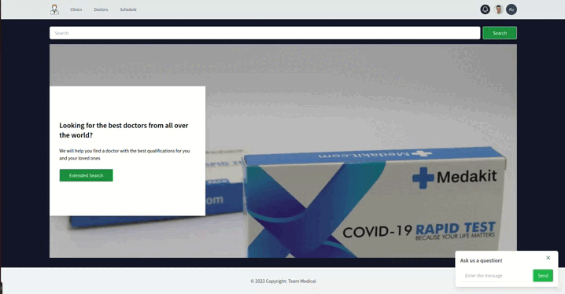

# Агрегатор медицинских услуг
Поиск лучших врачей и клиник по всему миру.

Приложение выполнено в SPA.
Реализована регистрация, вход на сайт (JWT-tokens), Google-авторизация.
Есть локализация (RU\EN).


Есть возможность целевого и рандомного поиска врача\клиники, включая выборку по странам, городам, с привязкой к Google-map, сортировки по рейтингу.


---

Реализована возможность записи к врачу, с уведомлением на эл. почту и личный кабинет.


Есть страницы клиник, врачей, актуального расписания на сегодняшний день



Команда

- [Дмитрий Коваленко](https://github.com/dkovalenko174)

- [Ярослав Поличев](https://github.com/boonany)

- [Глеб Сидоров](https://github.com/glebobas)

- [Марина Шустрова](https://github.com/MarinaShustrova)

## Запуск проекта

В файле env_example в директории server указаны необходимые данные для запуска почтового клиента. Необходимо добавить собственную почту и пароль к ней для редиректа сообщений.
Переименовываем файл env_example в .env

- устанваливаем PostgreSQL:
для Ubuntu

```bash
sudo apt-get -y install postgresql
```
*для  остальных платформ - https://www.postgresql.org/download/

Клонируем репозиторий к себе на ПК
```bash
git clone git@github.com:dkovalenko174/medical-services-aggregator.git
```

Переходим в корневую директорию проекта, затем:
```bash
cd server 
```

Устанавливаем необходимые пакеты
```bash
npm install
```

Инициализируем БД
```bash
npx sequeize db:create;npx sequelize db:migrate;npx sequelize db:seed:all
```

Из корневой диерктории заходим в папку client
```bash
cd client
```

Устанавливаем зависимости 
```bash
npm install 
```

Запускаем сервер
```bash
npm run dev
```

Запускаем клиентскую часть
```bash
npm start
```

В браузере заходим на:
```bash
http://localhost:3001
```

